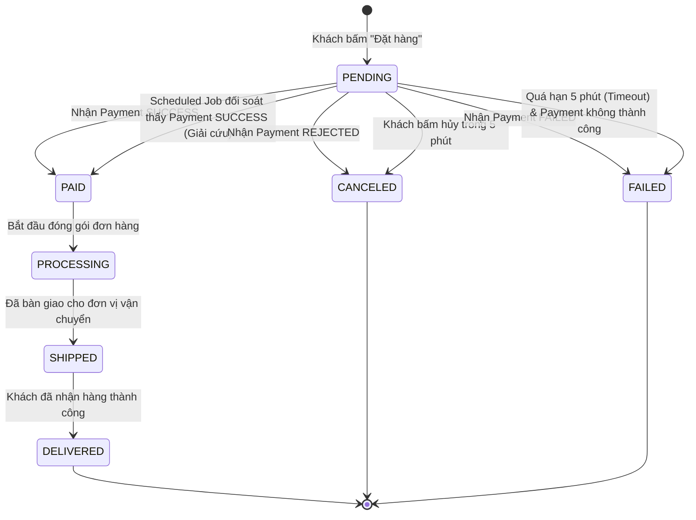

# BÁO CÁO THỰC HÀNH SESSION 14 - BÀI TẬP 2
## ĐỒNG BỘ TRẠNG THÁI "ĐƠN HÀNG LẠC LỐI" (ORDER STATE SYNCHRONIZATION)

---

### 1. Phân tích bài toán "Đơn hàng lạc lối"

- **Hiện tượng:** Khách hàng đã bị trừ tiền thành công trên tài khoản ví/ngân hàng (phía `Payment-Service`), nhưng trên giao diện và trong cơ sở dữ liệu của `Order-Service`, đơn hàng vẫn treo ở trạng thái `PENDING`.
- **Nguyên nhân gốc rễ (Root Cause):** Sự cố mạng phân tán (Network Partition / Packet Loss) xảy ra đúng thời điểm `Payment-Service` gửi gói tin phản hồi hoặc event sang `Order-Service`. Do sự kiện bị thất lạc hoặc consumer bị gián đoạn kết nối, hàm lắng nghe `handlePaymentResponse` không được kích hoạt, dẫn đến trạng thái đơn hàng không bao giờ được cập nhật.

---

### 2. Trả lời các yêu cầu kỹ thuật

#### a) Xác định đúng vị trí cần cập nhật trạng thái đơn hàng
- **Vị trí cập nhật tức thời (Event-driven):** Nằm tại Consumer / Event Listener lắng nghe kết quả thanh toán từ Message Broker (hoặc webhook). Trong đoạn code mẫu là phương thức `handlePaymentResponse(@EventListener PaymentResponseEvent event)`.
- **Vị trí cập nhật cứu hộ (Reconciliation / Fallback):** Cần bổ sung một **Scheduled Background Job** để định kỳ quét các đơn hàng bị "bỏ quên" ở trạng thái `PENDING` quá ngưỡng thời gian cho phép (ví dụ sau 5 phút).

#### b) Sửa logic xử lý phản hồi và đề xuất cơ chế Timeout

1. **Xử lý phản hồi thanh toán:**
   - Khi `event.getStatus() = "SUCCESS"`: Chuyển đơn hàng sang **`PAID`**.
   - Khi `event.getStatus() = "REJECTED"`: Chuyển đơn hàng sang **`CANCELED`** (Người dùng bị từ chối thẻ, số dư không hợp lệ, gian lận) và kích hoạt cơ chế hoàn giữ chỗ kho.
   - Khi `event.getStatus() = "FAILED"`: Chuyển đơn hàng sang **`FAILED`** (Lỗi kỹ thuật phía ngân hàng/cổng thanh toán).
   - **Tính lũy đẳng (Idempotency):** Trước khi cập nhật, kiểm tra nếu đơn hàng không còn ở `PENDING` (đã được cập nhật trước đó) thì bỏ qua để tránh ghi đè dữ liệu.

2. **Cơ chế xử lý Timeout (Khi không nhận được phản hồi):**
   - Áp dụng mô hình **Scheduled Reconciliation Job (Quét đối soát định kỳ)**:
     - Cứ mỗi 60 giây, một Scheduled Job quét cơ sở dữ liệu tìm các đơn hàng có trạng thái `PENDING` được tạo trước thời điểm hiện tại từ 5 phút trở lên.
     - **Giải cứu đơn hàng lạc lối:** Trước khi vội vã đánh dấu `FAILED`, Job sẽ chủ động gọi API sang `Payment-Service` (`GET /payments/order/{orderId}`) để hỏi trạng thái thực tế:
       + Nếu Payment báo **SUCCESS** (đã trừ tiền): Ngay lập tức cập nhật đơn thành **`PAID`** (cứu đơn hàng thành công, bảo vệ quyền lợi người mua).
       + Nếu Payment báo **REJECTED**: Cập nhật đơn thành **`CANCELED`**.
       + Nếu Payment báo chưa có giao dịch hoặc **FAILED**: Cập nhật đơn thành **`FAILED`** để nhả tồn kho cho khách hàng khác mua.

---

### 3. Sơ đồ chuyển trạng thái (State Machine) của đơn hàng

#### 3.1. Sơ đồ Mermaid State Diagram

#### 3.2. Bảng mô tả điều kiện chuyển đổi trạng thái

| Trạng thái nguồn | Trạng thái đích | Tác nhân / Sự kiện kích hoạt | Xử lý kèm theo |
| :--- | :--- | :--- | :--- |
| **`[*]` (Khởi tạo)** | **`PENDING`** | Khách bấm nút "Thanh toán". Đơn hàng được tạo nháp và giữ chỗ tồn kho. | Bắn event yêu cầu thanh toán sang `Payment-Service`. |
| **`PENDING`** | **`PAID`** | Nhận event `SUCCESS` từ Payment HOẶC Job đối soát thấy giao dịch đã thành công. | Gửi email xác nhận thanh toán, chuyển đơn sang bộ phận đóng gói (`PROCESSING`). |
| **`PENDING`** | **`CANCELED`** | Nhận event `REJECTED` từ Payment HOẶC khách chủ động hủy đơn trước thanh toán. | Nhả số lượng giữ chỗ tồn kho (Inventory Release). |
| **`PENDING`** | **`FAILED`** | Nhận event `FAILED` từ Payment HOẶC sau 5 phút không nhận được phản hồi (Timeout). | Gửi thông báo lỗi cho người dùng, hoàn kho. |
| **`PAID`** | **`PROCESSING`** | Kho hoàn tất xác nhận và đóng gói sản phẩm. | Chuẩn bị vận đơn cho shipper. |
| **`PROCESSING`** | **`SHIPPED`** | Đơn vị vận chuyển (Giao Hàng Nhanh...) tiếp nhận kiện hàng. | Cập nhật mã vận đơn tracking code cho người mua. |
| **`SHIPPED`** | **`DELIVERED`** | Shipper xác nhận giao hàng thành công. | Đóng vòng đời đơn hàng, kích hoạt cộng điểm thưởng (Loyalty). |

---

### 4. Danh sách các file mã nguồn đã tạo

1. [OrderStatus.java](file:///e:/IT214_BTVN/OrderStatus.java): Enum định nghĩa đầy đủ các trạng thái của State Machine (`PENDING`, `PAID`, `CANCELED`, `FAILED`, `PROCESSING`, `SHIPPED`, `DELIVERED`).
2. [PaymentResponseHandler.java](file:///e:/IT214_BTVN/PaymentResponseHandler.java): Logic cập nhật trạng thái đơn hàng khi nhận phản hồi thanh toán, có kiểm tra Idempotency và chuẩn hóa các nhánh SUCCESS/REJECTED/FAILED.
3. [OrderTimeoutScheduler.java](file:///e:/IT214_BTVN/OrderTimeoutScheduler.java): Scheduled Job định kỳ quét đơn hàng `PENDING` quá 5 phút, thực hiện đối soát tự động với Payment Service để xử lý timeout và giải cứu "đơn hàng lạc lối".
