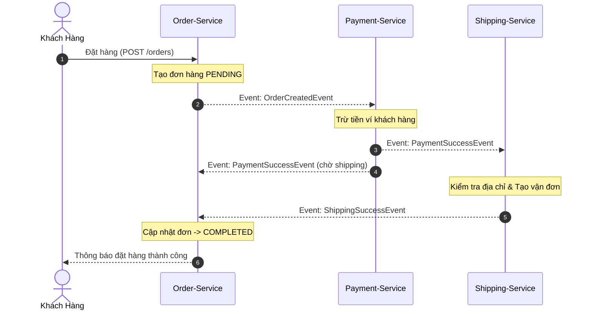
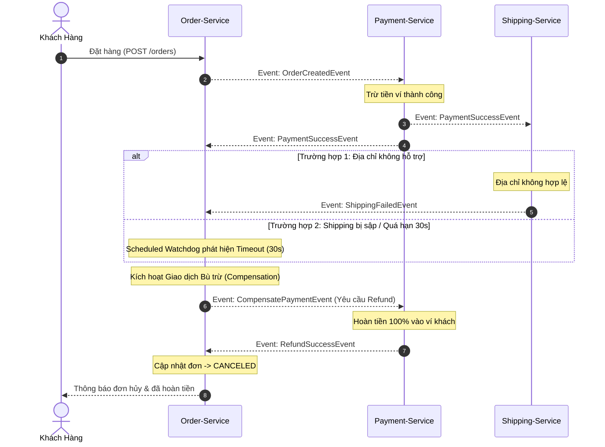

# BÁO CÁO THỰC HÀNH SESSION 14 - BÀI TẬP 3
## THIẾT KẾ VŨ ĐIỆU CHOREOGRAPHY SAGA (ORDER → PAYMENT → SHIPPING)

---

### 1. Phân tích Input và Output của quy trình (Yêu cầu a)

#### 1.1. Input (Dữ liệu đầu vào khi bắt đầu đặt hàng)
- **Thông tin khách hàng:** `customerId`, họ tên, số điện thoại, email.
- **Thông tin đơn hàng & sản phẩm (Tồn kho):** `itemSku`, số lượng đặt mua (`quantity`), đơn giá, tổng tiền cần thanh toán (`amount`).
- **Thông tin thanh toán (Ví tiền):** `walletId` / tài khoản thanh toán của khách hàng, số dư khả dụng $\ge amount$.
- **Thông tin giao hàng:** `shippingAddress` (Tỉnh/Thành phố, Quận/Huyện, địa chỉ chi tiết để đơn vị vận chuyển đối soát tuyến đường).

#### 1.2. Output (Trạng thái cuối cùng của 3 dịch vụ)

| Kịch bản | Order Service | Payment Service | Shipping Service | Trạng thái tổng thể hệ thống |
| :--- | :--- | :--- | :--- | :--- |
| **Luồng thành công (Happy Path)** | Trạng thái đơn: **`COMPLETED`** | Trạng thái giao dịch: **`PAID`** (Số tiền đã bị trừ từ ví) | Trạng thái vận đơn: **`CREATED`** (Có mã vận đơn `trackingNumber`) | Giao dịch thành công, hàng sẵn sàng bàn giao cho shipper. |
| **Luồng bù trừ (Shipping thất bại / Timeout)** | Trạng thái đơn: **`CANCELED`** | Trạng thái giao dịch: **`REFUNDED`** (Số tiền đã được hoàn trả 100% vào ví khách) | Trạng thái: **`FAILED` / `REJECTED`** (Không tạo vận đơn do địa chỉ không hỗ trợ) | Nhất quán dữ liệu sau cùng (Eventual Consistency), khách không bị mất tiền oan. |

---

### 2. Thiết kế luồng xử lý chi tiết

#### 2.1. Luồng xử lý thành công - Happy Path (Yêu cầu b)
1. **Order Service:** Nhận yêu cầu đặt hàng, tạo bản ghi đơn với trạng thái `PENDING`, phát sự kiện `OrderCreatedEvent`.
2. **Payment Service:** Lắng nghe `OrderCreatedEvent`, kiểm tra số dư và trừ tiền trong ví, phát sự kiện `PaymentSuccessEvent`.
3. **Shipping Service:** Lắng nghe `PaymentSuccessEvent`, kiểm tra địa chỉ hợp lệ, khởi tạo vận đơn, phát sự kiện `ShippingSuccessEvent`.
4. **Order Service:** Lắng nghe `ShippingSuccessEvent`, cập nhật trạng thái đơn sang **`COMPLETED`** (Đơn hàng thành công).

#### 2.2. Luồng bù trừ khi Shipping thất bại - Compensating Saga (Yêu cầu c)
1. **Shipping Service:** Lắng nghe `PaymentSuccessEvent`, kiểm tra thấy địa chỉ giao hàng không được hỗ trợ (nằm ngoài vùng phủ sóng) $\rightarrow$ Phát sự kiện `ShippingFailedEvent` kèm lý do lỗi.
2. **Order Service:** Lắng nghe `ShippingFailedEvent`, xác định bước tiếp theo bị lỗi $\rightarrow$ Phát sự kiện yêu cầu bù trừ `CompensatePaymentEvent`.
3. **Payment Service:** Lắng nghe `CompensatePaymentEvent`, thực hiện giao dịch hoàn trả tiền (Refund) vào ví của khách hàng $\rightarrow$ Phát sự kiện `RefundSuccessEvent`.
4. **Order Service:** Lắng nghe `RefundSuccessEvent`, cập nhật trạng thái đơn hàng sang **`CANCELED`** (Đơn đã hủy và hoàn tiền thành công).

#### 2.3. Xử lý sự cố Shipping Service Timeout (Yêu cầu d)
- **Vấn đề:** Nếu mạng bị đứt hoặc Shipping Service bị sập sau khi khách đã thanh toán, hệ thống không bao giờ nhận được `ShippingSuccess` hay `ShippingFailed`.
- **Cơ chế đề xuất (Saga Deadline / Timeout Watchdog):**
  - Trong `Order-Service`, khi chuyển trạng thái đơn sang `PAID_WAITING_SHIPPING`, hệ thống ghi nhận mốc thời gian `updatedAt`.
  - Một **Scheduled Job chạy nền (chạy mỗi 5 giây)** kiểm tra các đơn hàng đang ở trạng thái `PAID_WAITING_SHIPPING`:
    - Nếu sau **30 giây** mà chưa nhận được tín hiệu từ Shipping, hệ thống coi như Shipping Service đã Timeout.
    - Order Service chủ động kích hoạt luồng bù trừ bằng cách phát `CompensatePaymentEvent(reason = "SHIPPING_SERVICE_TIMEOUT_30S")`.
    - Payment Service hoàn tiền và Order chuyển sang `CANCELED`, đảm bảo quyền lợi khách hàng không bị treo tiền vô thời hạn.

---

### 3. Lưu đồ (Flowchart / Sequence Diagram)

#### 3.1. Lưu đồ luồng thành công (Happy Path)

#### 3.2. Lưu đồ luồng bù trừ khi Shipping Thất bại / Timeout (Compensating Flow)

---

### 4. Danh sách các file mã nguồn mô phỏng

Các file mã nguồn Java mô phỏng trọn vẹn vũ điệu Choreography Saga (Event-driven):
1. [SagaEvents.java](file:///e:/IT214_BTVN/SagaEvents.java): Định nghĩa các Event (`OrderCreatedEvent`, `PaymentSuccessEvent`, `ShippingSuccessEvent`, `ShippingFailedEvent`, `CompensatePaymentEvent`, `RefundSuccessEvent`).
2. [OrderSagaCoordinator.java](file:///e:/IT214_BTVN/OrderSagaCoordinator.java): Order Service quản lý vòng đời đơn hàng, kích hoạt bù trừ khi nhận `ShippingFailed` và tích hợp **Scheduled Watchdog xử lý Timeout sau 30 giây**.
3. [PaymentSagaListener.java](file:///e:/IT214_BTVN/PaymentSagaListener.java): Payment Service lắng nghe `OrderCreated` để trừ tiền và `CompensatePayment` để hoàn tiền (Refund).
4. [ShippingSagaListener.java](file:///e:/IT214_BTVN/ShippingSagaListener.java): Shipping Service kiểm tra địa chỉ giao hàng, tạo vận đơn thành công hoặc bắn `ShippingFailed` nếu địa chỉ không hỗ trợ.
